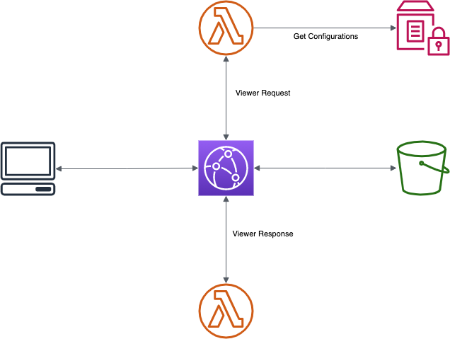

# CloudFront deployments with Lambda@Edge

Do A/B Testing, Blue/Green deployments, Canary releases with Lambda@Edge for CloudFront.

## Solution Overview

## Viewer Request

Let's start with the Lambda function that will react to the Viewer Request Event. This Lambda function is responsible for checking for our cookie _X-Version-Name_ if an value is set the function will update the request path based on the cookie value. If there is no value set it will roll the dice and get a random version and update the request path. This function will also match the value in cookie _X-Version-Reset_ towards a value in Parameter Store and if the value is different it will ignore any set value in _X-Version-Name_.  If there is no value in _X-Version-Name_ or if the value is ignored the function throws the dice and picks a version at random. The weight, for the different versions, are controlled by a value in Parameter Store. Finally the function pass the cookie to the next step in the call chain. 

## Viewer Response

The _Viewer Response_ function basically has one task, and that is to pass _set-cookie_ header to the client. This is needed so the client set the cookies _X-Version-Name_ and _X-Version-Reset_ so the client send them in the next request. This is important so the client doesn't jump between versions. The function has a small but very important job to do. 

## Deploying the functions

The Lambda functions need to be deployed in us-east-1 region, since that is the region Lambda@Edge originates from. We must also use a fixed version and can't use the _latest_ alias. As normal AWS SAM is used to define and deploy Lambda Functions.  

## CloudFront setup

Create the CloudFront distribution and set the Lambda functions for the Viewer Request and Response triggers. Normally CloudFront will not use and pass the headers to the cache. Since our setup is depending on two cookies we must make sure CloudFront pass them along. That is done by adding them to _WhitelistedNames_ section. Wildcards are supported so we just add _X-Version-*_ to that section.
